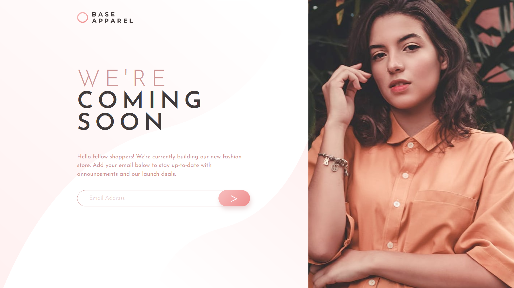

# Frontend Mentor - Base Apparel coming soon page solution

This is a solution to the [Base Apparel coming soon page challenge on Frontend Mentor](https://www.frontendmentor.io/challenges/base-apparel-coming-soon-page-5d46b47f8db8a7063f9331a0). Frontend Mentor challenges help you improve your coding skills by building realistic projects. 

## Table of contents

- [Frontend Mentor - Base Apparel coming soon page solution](#frontend-mentor---base-apparel-coming-soon-page-solution)
  - [Table of contents](#table-of-contents)
  - [Overview](#overview)
    - [The challenge](#the-challenge)
    - [Screenshot](#screenshot)
    - [Links](#links)
  - [My process](#my-process)
    - [Built with](#built-with)
    - [What I learned](#what-i-learned)
  - [Author](#author)

**Note: Delete this note and update the table of contents based on what sections you keep.**

## Overview

### The challenge

Users should be able to:

- View the optimal layout for the site depending on their device's screen size
- See hover states for all interactive elements on the page
- Receive an error message when the `form` is submitted if:
  - The `input` field is emptyV
  - The email address is not formatted correctly

### Screenshot

**Desktop view**

**Mobile view**

### Links

- Solution URL: [Github](https://github.com/gylim0604/FrontEndMentor-Base-Apparel)
- Live Site URL: [Vercel](https://front-end-mentor-base-apparel-gray.vercel.app/)

## My process

### Built with

- Semantic HTML5 markup
- CSS Grid
- Mobile-first workflow
- SCSS

### What I learned

This was one of those I need to do something, let me go to FrontEnd Mentor and find something projects. Honestly there wasn't anything to tricky about it. 

The only slightly interesting part was that there was a specific background used for the content. The size was not enough to cover the full screen, but I figured if I made the background the same size as my content excluding the image, it would work perfectly, and well it did :) . 

## Author

- Frontend Mentor - [@gylim0604](https://www.frontendmentor.io/profile/gylim0604)
